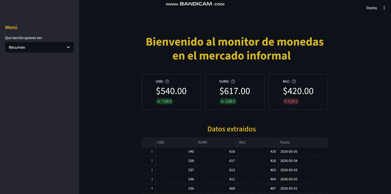
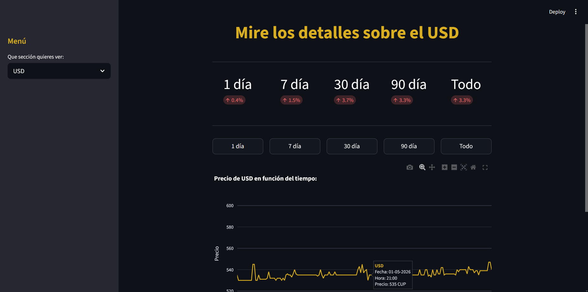
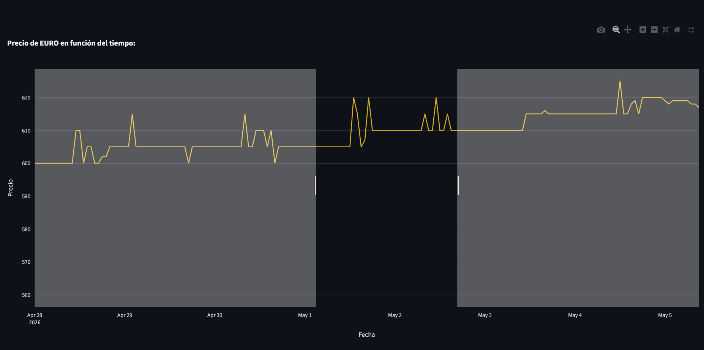
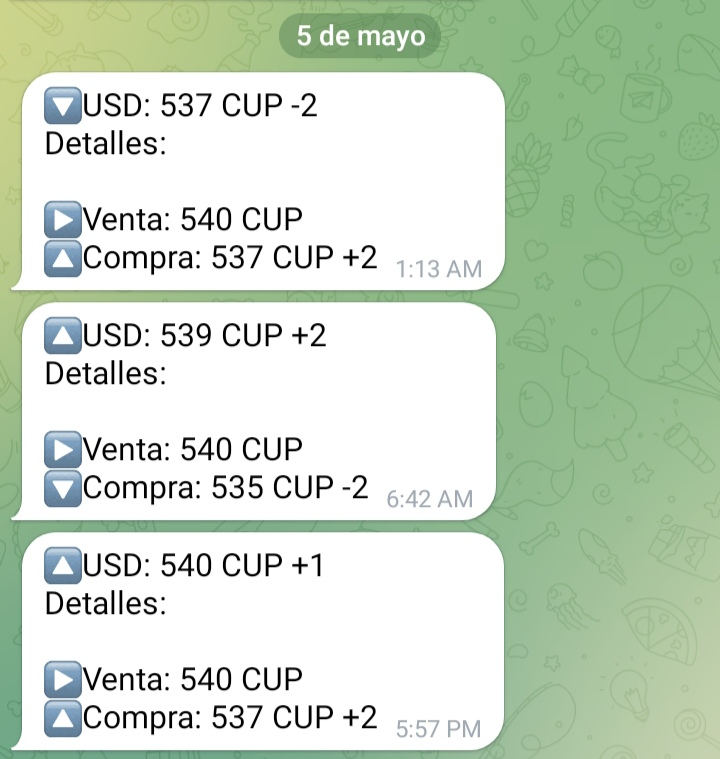
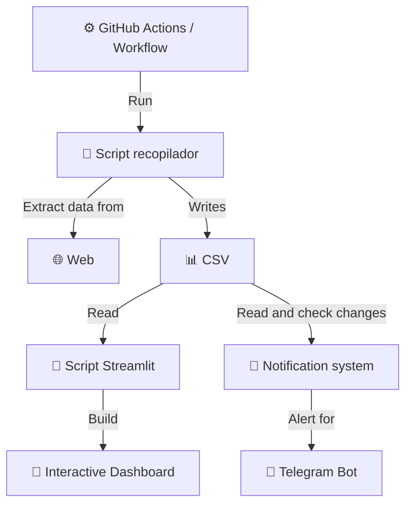
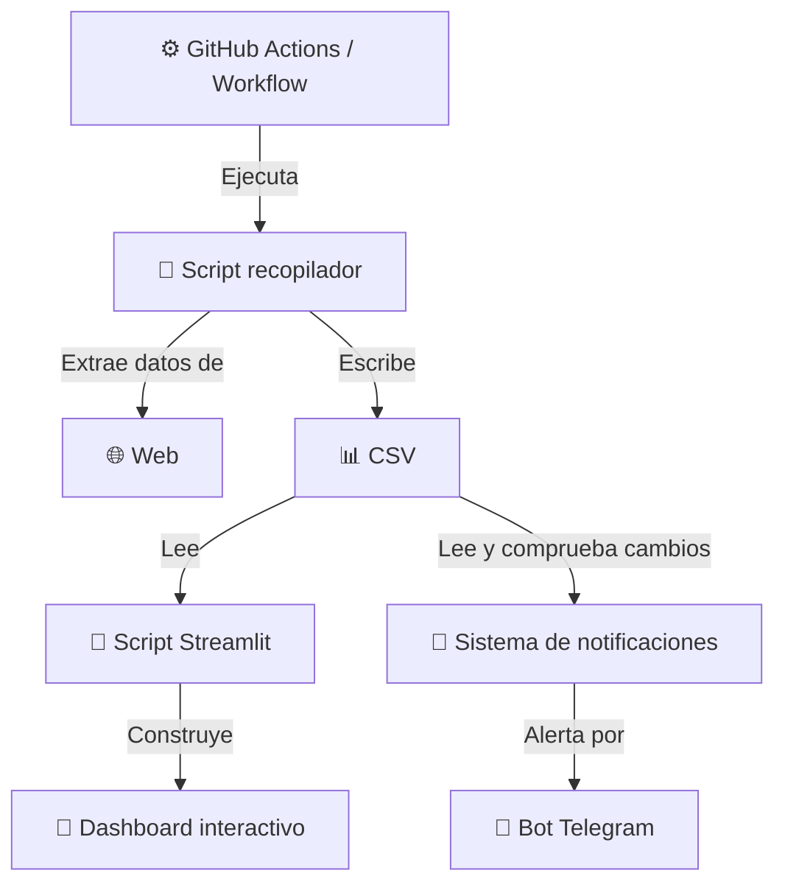

# 📡 Monitoring-Demo (English)

> Monitor anything on the web. Receive instant alerts. View it live.

[](https://monitoring-demo.streamlit.app/)

[](https://github.com/Monitoring-Code/Monitoring-Demo)

## 🎬 Live Demo



### 📊 Monitor overview



### 📈 Interactive Charts



### 🤖 Automatic notifications about relevant changes



---

> 🔗 *Try it yourself:* [monitoring-demo.streamlit.app](https://monitoring-demo.streamlit.app/)

## 📋 What does this project do??

This project automatically monitors the prices of the *USD, EURO and MLC*
in the Cuban informal market, autonomously collecting data each day
and displaying it on an interactive and visual dashboard.

But beyond the coins, this repository is a *real demonstration* of what I can build for you:

✅ Automated monitoring of any data or job opening on the web  
✅ Interactive and dynamic dashboard with Streamlit  
✅ Instant alerts via Telegram when something relevant happens  
✅ Everything working 24/7 without manual intervention  

> 💡 **Do you have prices, competitors, products, or any other data on the web that you need to monitor?** Puedo construirlo para ti.


## ⚙️ How it works



## 🔧 Technologies used

| Technology | Use |
|----------------------------------------------------------------------------------------------|--------------------|
|  | Primary language |
|  | Interactive Dashboard |
|  | Interactive Charts |
|  | CSV Manipulation |
|  | API requests |
|  | Workflow automation |
|  |Notification system |
|  | Control system |

## 💡 What can it be adapted to?

This system isn't exclusive to currencies. I can adapt it to monitor any data available on the web.

| Use case | Example |
|-------------|---------|
| 💰 Prices | Products in online stores, fuel, cryptocurrencies |
| 📦 Stock | Product availability in e-commerce |
| 🏪 Competence | Competitor price tracking |
| 📡 Public APIs | Any data accessible via REST API |
| 🏠 Real estate | Price variations on real estate portals |
| 🔍 Vacancies | Detect job vacancies on web portals |
| 📰 News | Keyword monitoring in digital media |

> 💬 *You have a specific case in mind?* Contact me and we'll evaluate it together.

## 🚀 Installation and execution

### 1️⃣ Clone the repository

```bash
git clone https://github.com/Monitoring-Cofe/Monitoring-Demo.git
cd Monitoring-Demo
```

### 2️⃣ Install the dependencies

```bash
pip install -r requirements.txt
```

### 3️⃣ Get the API Key

- Go to https://tasas.eltoque.com
- Request an API Key
- Wait for the email response

### ⚙️ Option A — Automatic deployment with GitHub Actions (recommended)

1. Clone the repo to your GitHub account as a repository *public*
2. Create the file .github/workflows/scraper.yml with the following configuration:

```bash
name: Ejecutar Scrapper_Run

on:
  schedule:
    - cron: "0 * * * *"
  workflow_dispatch:

permissions:  
  contents: write

jobs:
  run-script:
    runs-on: ubuntu-latest

    env:
      API_KEY: ${{ secrets.API_KEY_PRECIOS }}
      
    steps:
      - name: Descargar repositorio
        uses: actions/checkout@v3

      - name: Configurar Python
        uses: actions/setup-python@v4
        with:
          python-version: "3.10"
          
      - name: Instalar dependencias
        run: pip install requests pandas
          
      - name: Ejecutar script
          
        run: python API_Compiler.py

      - name: Añadir archivos creados
        run: |
          git config --global user.name "github-actions[bot]"
          git config --global user.email "github-actions[bot]@users.noreply.github.com"
          git add DB/DB_Precios.csv Log/Historial.log
          git commit -m "Actualizar CSV automático" --amend --no-edit || echo "No hay cambios"
          git push --force
```


3. Add your API Key in Settings > Secrets and variables > Actions > New repository secret
4. Deploy the dashboard in [Streamlit Community Cloud](https://streamlit.io/cloud):
   - Log in with your GitHub account
   - Select the repository and the file Monitor.py
   - Ready!

### 🖥️ Option B — Own server

1. Clone the repository to your server
2. Configure a *cron job* to automatically run the collection script:

```bash
0 8 * * * cd /ruta/del/proyecto && python API_Compiler.py
```

3. Deploy Monitor.py in [Streamlit Community Cloud](https://streamlit.io/cloud) pointing to your public repository where the CSV is updated

> ⚠️ Do you need help with the setup? Contact me directly.

## 🤝 Do you need something similar?

If you have web data that you need to monitor, I can build you a custom solution with:

- 🔍 Scraping or API integration
- 📊 Interactive dashboard with Streamlit
- 🤖 Automatic alerts via Telegram
- ⚙️ 24/7 automation without manual intervention

*Contact me and we'll talk!*

[](mailto:oscarcalero700@gmail.com)

[](https://www.upwork.com/freelancers/~010959a7a702614a87?mp_source=share)

[](https://wa.me/5358535583)

---

# 📡 Monitoring-Demo (Español)

> Monitorea cualquier cosa en la web. Recibe alertas al instante. Visualízalo en vivo.

[](https://monitoring-demo.streamlit.app/)

[](https://github.com/Monitoring-Code/Monitoring-Demo)


### 🎬 Demo en vivo


### 📊 Vista general del monitor


### 📈 Gráficos interactivos


### 🤖 Notificaciones automáticas sobre cambios relevantes


---

> 🔗 *Pruébalo tú mismo:* [monitoring-demo.streamlit.app](https://monitoring-demo.streamlit.app/)

## 📋 ¿Qué hace este proyecto?

Este proyecto monitorea automáticamente los precios del *USD, EURO y MLC* 
en el mercado informal cubano, recopilando datos cada día de forma autónoma 
y mostrándolos en un dashboard interactivo y visual.

Pero más allá de las monedas, este repositorio es una *demostración real* 
de lo que puedo construir para ti:

✅ Monitoreo automatizado de cualquier dato o vacante en la web  
✅ Dashboard interactivo y dinámico con Streamlit  
✅ Alertas instantáneas por Telegram cuando ocurre algo relevante  
✅ Todo funcionando 24/7 sin intervención manual  

> 💡 **¿Tienes precios, competidores, productos o cualquier dato en la web 
> que necesites vigilar?** Puedo construirlo para ti.


## ⚙️ Cómo funciona



## 🔧 Tecnologías usadas

| Tecnología | Uso |
|----------------------------------------------------------------------------------------------|--------------------|
|  | Lenguaje principal |
|  | Dashboard interactivo |
|  | Gráficos interactivos |
|  | Manipulación del CSV |
|  | Peticiones a la API |
|  | Automatización del workflow |
|  | Sistema de notificaciones |
|  | Sistema de control |

## 💡 ¿A qué se puede adaptar?

Este sistema no es exclusivo para monedas. Puedo adaptarlo para monitorear 
cualquier dato disponible en la web:

| Caso de uso | Ejemplo |
|-------------|---------|
| 💰 Precios | Productos en tiendas online, combustible, criptomonedas |
| 📦 Stock | Disponibilidad de productos en e-commerce |
| 🏪 Competencia | Seguimiento de precios de competidores |
| 📡 APIs públicas | Cualquier dato accesible via API REST |
| 🏠 Bienes raíces | Variaciones de precios en portales inmobiliarios |
| 🔍 Vacantes | Detectar vacantes de empleos en portales web |
| 📰 Noticias | Monitoreo de palabras clave en medios digitales |

> 💬 *¿Tienes un caso específico en mente?* Contáctame y lo evaluamos juntos.

## 🚀 Instalación y ejecución

### 1️⃣ Clona el repositorio

```bash
git clone https://github.com/Monitoring-Cofe/Monitoring-Demo.git
cd Monitoring-Demo
```

### 2️⃣ Instala las dependencias

```bash
pip install -r requirements.txt
```

### 3️⃣ Obtén la API Key

- Vé a https://tasas.eltoque.com
- Solicita una API Key
- Espera la respuesta por email

### ⚙️ Opción A — Despliegue automático con GitHub Actions (recomendado)

1. Clona el repo en tu cuenta de GitHub como repositorio *público*
2. Crea el archivo .github/workflows/scraper.yml con la siguiente configuración:

```bash
name: Ejecutar Scrapper_Run

on:
  schedule:
    - cron: "0 * * * *"
  workflow_dispatch:

permissions:  
  contents: write

jobs:
  run-script:
    runs-on: ubuntu-latest

    env:
      API_KEY: ${{ secrets.API_KEY_PRECIOS }}
      
    steps:
      - name: Descargar repositorio
        uses: actions/checkout@v3

      - name: Configurar Python
        uses: actions/setup-python@v4
        with:
          python-version: "3.10"
          
      - name: Instalar dependencias
        run: pip install requests pandas
          
      - name: Ejecutar script
          
        run: python API_Compiler.py

      - name: Añadir archivos creados
        run: |
          git config --global user.name "github-actions[bot]"
          git config --global user.email "github-actions[bot]@users.noreply.github.com"
          git add DB/DB_Precios.csv Log/Historial.log
          git commit -m "Actualizar CSV automático" --amend --no-edit || echo "No hay cambios"
          git push --force
```


3. Añade tu API Key en Settings > Secrets and variables > Actions > New repository secret
4. Despliega el dashboard en [Streamlit Community Cloud](https://streamlit.io/cloud):
   - Inicia sesión con tu cuenta de GitHub
   - Selecciona el repositorio y el archivo Monitor.py
   - ¡Listo!

### 🖥️ Opción B — Servidor propio

1. Clona el repositorio en tu servidor
2. Configura un *cron job* para ejecutar el script recopilador automáticamente:

```bash
0 8 * * * cd /ruta/del/proyecto && python API_Compiler.py
```

3. Despliega Monitor.py en [Streamlit Community Cloud](https://streamlit.io/cloud) apuntando a tu repositorio público donde se actualiza el CSV

> ⚠️ ¿Necesitas ayuda con la configuración? Contáctame directamente.

## 🤝 ¿Necesitas algo similar?

Si tienes datos en la web que necesitas monitorear, puedo construirte una 
solución personalizada con:

- 🔍 Scraping o integración con APIs
- 📊 Dashboard interactivo con Streamlit
- 🤖 Alertas automáticas por Telegram
- ⚙️ Automatización 24/7 sin intervención manual

*¡Contáctame y hablamos!*

[](mailto:oscarcalero700@gmail.com)

[](https://www.upwork.com/freelancers/~010959a7a702614a87?mp_source=share)

[](https://wa.me/5358535583)


